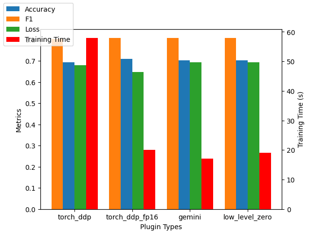

# Fine-Tuning-GPT2-With-ColossalAI

- github link: https://github.com/YoHoSo/Fine-Tuning-GPT2-With-ColossalAI
- Model used: GPT2
- Parallel settings: none, since I only have one gpu.

## Dataset and Task

For this assignment, MRPC dataset in GLUE benchmark is used. The MRPC task's goal is to assess whether two sentences are consistent. The input is two sentences and the output is a binary label.

## How to run my code

execuete `./run.sh`, it will run 4 experiments using 4 different plugins, torch_ddp, torch_ddp_fp16, gemini, low_level_zero.

I was not able to reproduce the hybrid_parallel experiment due compatibility issue among FlashAttention package, torch and cuda. The cuda version of my machine is 11.3, the torch version is 1.12 with cuda version 11.3, which follows the version specified in the [ColossalAI repo](https://github.com/hpcaitech/ColossalAI/tree/main/examples/language/gpt). But FlashAttention requires cuda to be higher than 11.6.

## Experiment Results

| Plugin Type    | Accuracy | F1     | Val Loss | Training Time(seconds) |
|----------------|----------|--------|----------|------------------------|
| torch_ddp      | 0.6944   | 0.8040 | 0.6804   | 58                     |
| torch_ddp_fp16 | 0.7107   | 0.8097 | 0.6481   | 20                     |
| gemini         | 0.7031   | 0.8079 | 0.6931   | 17                     |
| low_level_zero | 0.7031   | 0.8079 | 0.6931   | 19                     |

